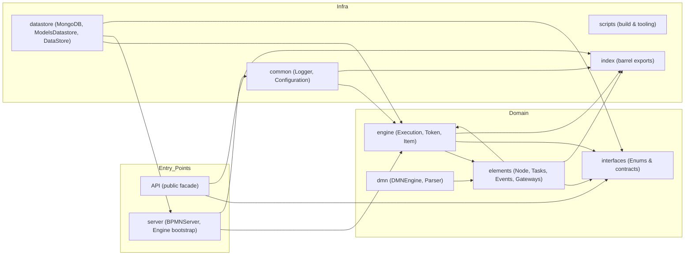
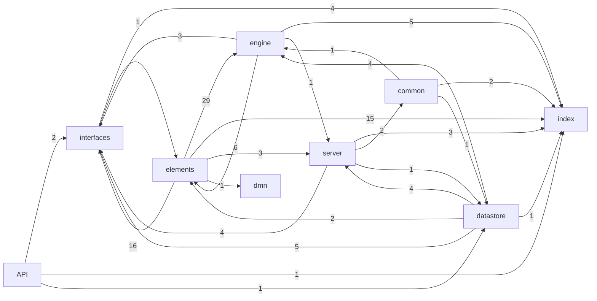

# Architecture Overview

**Source of truth:** generated from `docs/arch-map.json` (`generatedAt`: 2025-10-29T16:56:52.329Z).  
This document summarizes the codebase structure, its dependency graph, and risks. It is meant to live at `docs/ARCHITECTURE.md`.

---

## 1) Layers

We organize modules into three layers: **Entry points → Domain → Infra**. The diagram shows typical data/control flow.

**Notes**  
- *Entry points*: the public **API** surface and the **server** bootstrap are how external callers interact.  
- *Domain*: the **engine**, **elements**, **dmn**, and **interfaces** contain execution logic, BPMN/DMN models, and contracts.  
- *Infra*: persistence (**datastore**), configuration/logging (**common**), and barrels/tooling (**index**, **scripts**).

---

## 2) Top 10 high‑fan‑in modules (most imported)

Modules most depended upon tend to be *architectural gravity wells*. Changes here are high risk; prefer stable APIs and strong tests.

| # | Module | Fan-in | Why it’s central |
|---:|---|---:|---|
| 1 | `src/index.ts` | 31 | Root barrel that re-exports most public types; convenient but increases hidden coupling. |
| 2 | `src/elements/index.ts` | 25 | Aggregates BPMN element types; referenced by engine and model parsers. |
| 3 | `src/interfaces/index.ts` | 23 | Shared enums and contracts; consumed across all layers. |
| 4 | `src/engine/Item.ts` | 18 | Per-step execution context used by behaviours and nodes. |
| 5 | `src/elements/behaviours/index.ts` | 16 | Entry to behaviour implementations; widely used by element types. |
| 6 | `src/engine/Token.ts` | 10 | Represents a path of execution; used by nodes and flows. |
| 7 | `src/engine/Execution.ts` | 9 | Top-level runtime controller coordinating tokens and items. |
| 8 | `src/interfaces/Enums.ts` | 6 | Status and type enums used across engine and elements. |
| 9 | `src/engine/index.ts` | 5 | Barrel for engine primitives; used by infra and elements. |
| 10 | `src/server/ServerComponent.ts` | 5 | Base for server-side components; dependency of cache/cron/server. |

---

## 3) Package‑level data/dep flow

Edges show imports between packages (number = import sites).

**Interpretation**  
- **elements → engine (29)**: element types lean on runtime primitives.  
- **elements → interfaces (16)** and **engine → elements (6)** indicate a *mutual dependency* between model and runtime. Consider extracting slimmer contracts to **interfaces** to reduce coupling.  
- **datastore → server (4)** and **server → interfaces (4)** show server orchestration tied to persistence contracts.

---

## 4) Risks & observations

### Cycles / mutual dependencies
- **elements ↔ engine** — 29 imports one way, 6 the other. Consider breaking the cycle with interfaces or inversion of control.
- **elements ↔ interfaces** — 16 imports one way, 1 the other. Consider breaking the cycle with interfaces or inversion of control.
- **datastore ↔ server** — 4 imports one way, 1 the other. Consider breaking the cycle with interfaces or inversion of control.

### Barrels & “god” modules
- **`src/index.ts`** has **very high fan‑in (31)**. It’s convenient but couples distant parts through a single re‑export surface. Prefer importing from concrete packages (e.g., `engine/Execution`) to make dependencies explicit.
- **`elements/index.ts` (25)** and **`interfaces/index.ts` (23)** are similar gravity points. Keep their surfaces stable and minimal.

### Implicit singletons / stateful services (watch outs)
- **Server orchestration**: `server/BPMNServer`, `server/Engine`, `server/Cron`, and `server/CacheManager` behave as application‑wide services. If used as shared instances, guard against hidden global state and race conditions.
- **Persistence**: `datastore/MongoDB` and `InstanceLocker` imply process‑wide resources. Encapsulate connection lifecycle and consider factory‑based construction to aid testing.
- **Timing & events**: `elements/behaviours/Timer` interacts with `server/Cron`; ensure clear ownership and cancellation semantics to prevent orphaned timers.

### Other observations
- **Enums as coupling**: `interfaces/Enums` is shared across layers; keep it cohesive to avoid ripple effects.  
- **Child processes / VM**: the use of `child_process` and `vm` (in ScriptHandler/DefaultConfiguration) increases sandboxing/security surface; validate inputs and timeouts.

---

## 5) Glossary of domain terms (with file anchors)

Key concepts and where to find their definitions/implementations.

- **AdHocSubProcess** — BPMN task types supported by the engine. Files: [`elements/Tasks`](../src/elements/Tasks.ts), [`elements/index`](../src/elements/index.ts), [`index`](../src/index.ts)

- **BPMNServer** — Server orchestration infrastructure components. Files: [`index`](../src/index.ts), [`server/BPMNServer`](../src/server/BPMNServer.ts), [`server/index`](../src/server/index.ts)

- **BPMN_TYPE** — Shared enums and type constants. Files: [`elements/NodeLoader`](../src/elements/NodeLoader.ts), [`elements/index`](../src/elements/index.ts), [`index`](../src/index.ts), [`interfaces/Enums`](../src/interfaces/Enums.ts), [`interfaces/index`](../src/interfaces/index.ts)

- **BoundaryEvent** — Event types used in BPMN execution and modeling. Files: [`elements/Events`](../src/elements/Events.ts), [`elements/index`](../src/elements/index.ts), [`index`](../src/index.ts)

- **BusinessRuleTask** — BPMN task types supported by the engine. Files: [`elements/Tasks`](../src/elements/Tasks.ts), [`elements/index`](../src/elements/index.ts), [`index`](../src/index.ts)

- **CacheManager** — Server orchestration infrastructure components. Files: [`index`](../src/index.ts), [`server/CacheManager`](../src/server/CacheManager.ts), [`server/index`](../src/server/index.ts)

- **CallActivity** — BPMN task types supported by the engine. Files: [`elements/Tasks`](../src/elements/Tasks.ts), [`elements/index`](../src/elements/index.ts), [`index`](../src/index.ts)

- **CatchEvent** — Event types used in BPMN execution and modeling. Files: [`elements/Events`](../src/elements/Events.ts), [`elements/index`](../src/elements/index.ts), [`index`](../src/index.ts)

- **Cron** — Server orchestration infrastructure components. Files: [`index`](../src/index.ts), [`server/Cron`](../src/server/Cron.ts), [`server/index`](../src/server/index.ts)

- **DMNEngine** — DMN evaluation and parsing components (decision tables). Files: [`dmn/DMNEngine`](../src/dmn/DMNEngine.ts)

- **DMNParser** — DMN evaluation and parsing components (decision tables). Files: [`dmn/DMNParser`](../src/dmn/DMNParser.ts)

- **DataStore** — Persistence layer and model storage utilities. Files: [`datastore/DataStore`](../src/datastore/DataStore.ts), [`datastore/index`](../src/datastore/index.ts), [`index`](../src/index.ts)

- **Definition** — Static BPMN model abstractions parsed from BPMN files. Files: [`elements/Definition`](../src/elements/Definition.ts), [`elements/index`](../src/elements/index.ts), [`index`](../src/index.ts)

- **EXECUTION_EVENT** — Shared enums and type constants. Files: [`index`](../src/index.ts), [`interfaces/Enums`](../src/interfaces/Enums.ts), [`interfaces/index`](../src/interfaces/index.ts)

- **EXECUTION_STATUS** — Shared enums and type constants. Files: [`index`](../src/index.ts), [`interfaces/Enums`](../src/interfaces/Enums.ts), [`interfaces/index`](../src/interfaces/index.ts)

- **Element** — Static BPMN model abstractions parsed from BPMN files. Files: [`elements/Element`](../src/elements/Element.ts), [`elements/index`](../src/elements/index.ts), [`index`](../src/index.ts)

- **EndEvent** — Event types used in BPMN execution and modeling. Files: [`elements/Events`](../src/elements/Events.ts), [`elements/index`](../src/elements/index.ts), [`index`](../src/index.ts)

- **Engine** — Server orchestration infrastructure components. Files: [`index`](../src/index.ts), [`server/Engine`](../src/server/Engine.ts), [`server/index`](../src/server/index.ts)

- **Event** — Event types used in BPMN execution and modeling. Files: [`elements/Events`](../src/elements/Events.ts), [`elements/index`](../src/elements/index.ts), [`index`](../src/index.ts)

- **EventBasedGateway** — Static BPMN model abstractions parsed from BPMN files. Files: [`elements/Gateway`](../src/elements/Gateway.ts), [`elements/index`](../src/elements/index.ts), [`index`](../src/index.ts)

- **Execution** — Core runtime primitives of the process engine. Files: [`engine/Execution`](../src/engine/Execution.ts), [`engine/index`](../src/engine/index.ts), [`index`](../src/index.ts)

- **Flow** — Static BPMN model abstractions parsed from BPMN files. Files: [`elements/Flow`](../src/elements/Flow.ts), [`elements/index`](../src/elements/index.ts), [`index`](../src/index.ts)

- **Gateway** — Static BPMN model abstractions parsed from BPMN files. Files: [`elements/Gateway`](../src/elements/Gateway.ts), [`elements/index`](../src/elements/index.ts), [`index`](../src/index.ts)

- **ITEM_STATUS** — Shared enums and type constants. Files: [`index`](../src/index.ts), [`interfaces/Enums`](../src/interfaces/Enums.ts), [`interfaces/index`](../src/interfaces/index.ts)

- **InstanceLocker** — Persistence layer and model storage utilities. Files: [`datastore/InstanceLocker`](../src/datastore/InstanceLocker.ts), [`datastore/index`](../src/datastore/index.ts), [`index`](../src/index.ts)

- **InstanceObject** — Query and typed projection helpers over runtime data. Files: [`engine/Model`](../src/engine/Model.ts), [`engine/index`](../src/engine/index.ts), [`index`](../src/index.ts)

- **Item** — Core runtime primitives of the process engine. Files: [`engine/Item`](../src/engine/Item.ts), [`engine/index`](../src/engine/index.ts), [`index`](../src/index.ts)

- **ItemObject** — Query and typed projection helpers over runtime data. Files: [`engine/Model`](../src/engine/Model.ts), [`engine/index`](../src/engine/index.ts), [`index`](../src/index.ts)

- **Loop** — Core runtime primitives of the process engine. Files: [`engine/Loop`](../src/engine/Loop.ts), [`engine/index`](../src/engine/index.ts), [`index`](../src/index.ts)

- **LoopObject** — Query and typed projection helpers over runtime data. Files: [`engine/Model`](../src/engine/Model.ts), [`engine/index`](../src/engine/index.ts), [`index`](../src/index.ts)

- **MessageFlow** — Static BPMN model abstractions parsed from BPMN files. Files: [`elements/Flow`](../src/elements/Flow.ts), [`elements/index`](../src/elements/index.ts), [`index`](../src/index.ts)

- **ModelsDatastore** — Persistence layer and model storage utilities. Files: [`datastore/ModelsDatastore`](../src/datastore/ModelsDatastore.ts), [`datastore/index`](../src/datastore/index.ts), [`index`](../src/index.ts)

- **ModelsDatastoreDB** — Persistence layer and model storage utilities. Files: [`datastore/ModelsDatastoreDB`](../src/datastore/ModelsDatastoreDB.ts), [`datastore/index`](../src/datastore/index.ts), [`index`](../src/index.ts)

- **MongoDB** — Persistence layer and model storage utilities. Files: [`datastore/MongoDB`](../src/datastore/MongoDB.ts), [`datastore/index`](../src/datastore/index.ts), [`index`](../src/index.ts)

- **NODE_SUBTYPE** — Shared enums and type constants. Files: [`index`](../src/index.ts), [`interfaces/Enums`](../src/interfaces/Enums.ts), [`interfaces/index`](../src/interfaces/index.ts)

- **Node** — Static BPMN model abstractions parsed from BPMN files. Files: [`elements/Node`](../src/elements/Node.ts), [`elements/index`](../src/elements/index.ts), [`index`](../src/index.ts)

- **Process** — Static BPMN model abstractions parsed from BPMN files. Files: [`elements/Process`](../src/elements/Process.ts), [`elements/index`](../src/elements/index.ts), [`index`](../src/index.ts)

- **Query** — Query and typed projection helpers over runtime data. Files: [`engine/Model`](../src/engine/Model.ts), [`engine/index`](../src/engine/index.ts), [`index`](../src/index.ts)

- **ReceiveTask** — BPMN task types supported by the engine. Files: [`elements/Tasks`](../src/elements/Tasks.ts), [`elements/index`](../src/elements/index.ts), [`index`](../src/index.ts)

- **ScriptTask** — BPMN task types supported by the engine. Files: [`elements/Tasks`](../src/elements/Tasks.ts), [`elements/index`](../src/elements/index.ts), [`index`](../src/index.ts)

- **SendTask** — BPMN task types supported by the engine. Files: [`elements/Tasks`](../src/elements/Tasks.ts), [`elements/index`](../src/elements/index.ts), [`index`](../src/index.ts)

- **ServerComponent** — Server orchestration infrastructure components. Files: [`index`](../src/index.ts), [`server/ServerComponent`](../src/server/ServerComponent.ts), [`server/index`](../src/server/index.ts)

- **ServiceTask** — BPMN task types supported by the engine. Files: [`elements/Tasks`](../src/elements/Tasks.ts), [`elements/index`](../src/elements/index.ts), [`index`](../src/index.ts)

- **StartEvent** — Event types used in BPMN execution and modeling. Files: [`elements/Events`](../src/elements/Events.ts), [`elements/index`](../src/elements/index.ts), [`index`](../src/index.ts)

- **SubProcess** — BPMN task types supported by the engine. Files: [`elements/Tasks`](../src/elements/Tasks.ts), [`elements/index`](../src/elements/index.ts), [`index`](../src/index.ts)

- **TOKEN_STATUS** — Shared enums and type constants. Files: [`index`](../src/index.ts), [`interfaces/Enums`](../src/interfaces/Enums.ts), [`interfaces/index`](../src/interfaces/index.ts)

- **ThrowEvent** — Event types used in BPMN execution and modeling. Files: [`elements/Events`](../src/elements/Events.ts), [`elements/index`](../src/elements/index.ts), [`index`](../src/index.ts)

- **Token** — Core runtime primitives of the process engine. Files: [`engine/Token`](../src/engine/Token.ts), [`engine/index`](../src/engine/index.ts), [`index`](../src/index.ts)

- **TokenObject** — Query and typed projection helpers over runtime data. Files: [`engine/Model`](../src/engine/Model.ts), [`engine/index`](../src/engine/index.ts), [`index`](../src/index.ts)

- **Transaction** — Static BPMN model abstractions parsed from BPMN files. Files: [`elements/Transaction`](../src/elements/Transaction.ts), [`elements/index`](../src/elements/index.ts), [`index`](../src/index.ts)

- **UserTask** — BPMN task types supported by the engine. Files: [`elements/Tasks`](../src/elements/Tasks.ts), [`elements/index`](../src/elements/index.ts), [`index`](../src/index.ts)

- **XORGateway** — Static BPMN model abstractions parsed from BPMN files. Files: [`elements/Gateway`](../src/elements/Gateway.ts), [`elements/index`](../src/elements/index.ts), [`index`](../src/index.ts)

---

## Regeneration

This file can be regenerated from `docs/arch-map.json`. If you add packages or move files, re-run the graph export and refresh this document.
