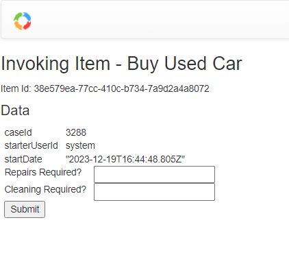
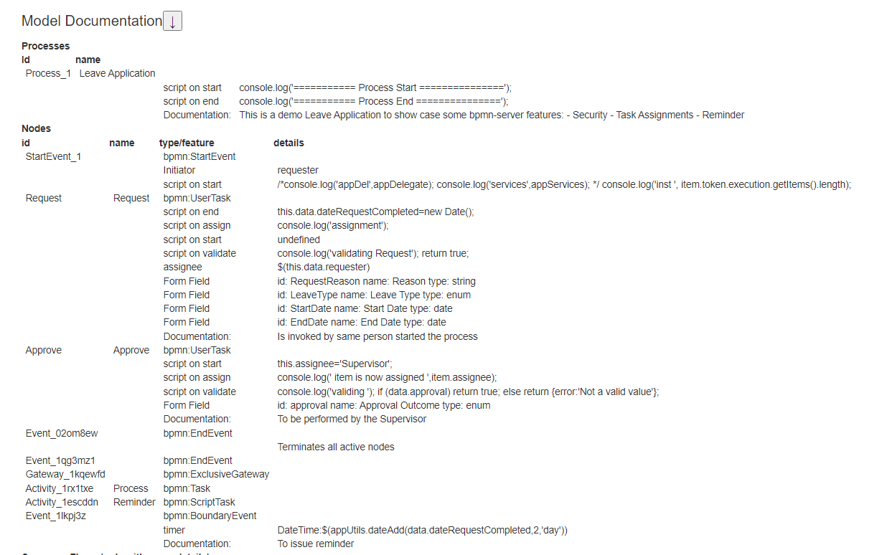

# Overview 

`bpmn-server` provides a Workflow component based on **Business Process Model and Notation** that can be easily integrated into your application.


As workflow application can outlive Node.js applications, `bpmn-server` has out-of-the-box state presistence and variables, with concurrency across Node.js cluster and process instances
to make them ideal platform to do long running business processes, durable services or scheduled backgound tasks.


## Modeling
`bpmn-server` provides a modeling tool based on `bpmn.io` with customized property panel, no need to edit bpmn files


`bpmn` models can also be imported from other tools.

Typically your application has multiple bpmn models, a model is represented in a bpmn definition (xml).

Each Model is made of various elements, an `element` can be a `node` in the diagram (events/tasks/gateway) or a  `flow`

Models are saved by `bpmn-server` and can be queried [see API.model](https://bpmnserver.github.io/bpmn-server/api/interfaces/IAPIModel)

`bpmn-server` support all bpmn 2.0 elements [see Modeling Support](https://bpmnserver.github.io/bpmn-server/examples)

## Execution
`bpmn-server` is primiraly an execution engine for bpmn models.


Execution is based on the model logic that is enhanced by various extensions that allow scripting and access to your application.

During Execution, Model Listeners and Application Listeners are invoked.

Everytime a model is executed (started), an `instance` is created, and for each `element` that is executed it creates an `item' 


### Invoking Execution Engine

You can communicate with the the execution `engine' through an API [see API.engine](https://bpmnserver.github.io/bpmn-server/api/interfaces/IAPIEngine)
 to `start` a Workflow or to `continue` executin of an Item, etc.

[For more details about Invoking Execution Engine](https://bpmnserver.github.io/bpmn-server/invokation)

### Execution logic and scripting
During Execution of the work bpmn-server can invoke custom scripts at various event or call back your business application

[For more details about Execution behaviour](https://bpmnserver.github.io/bpmn-server/execution)

## Datastore

At various stages of execution, instance object with its parts is saved into a datastore (defaults to MongoDB)

Instances and Items can be queried through an API [see API.data](https://bpmnserver.github.io/bpmn-server/api/interfaces/IAPIData)

[For more details about data management](https://bpmnserver.github.io/bpmn-server/data)

# User Management and Security

`bpmn-server` is relying on the front-end applicaton to authenticate users and to pass user information through the API.
1. Model designer/developr can define assignee, candidateUsers, candidateUserGroups as static string or JavaScript expressions

2. Application fron-end need to pass the implementation of `userService' 
  
3. `bpmnServer` will enforce security rules based on the current user passed by the application

`bpmn-web` Demo Application , provides a complete implementation of users management using Passport and MongoDB.

[For more details about security](https://bpmnserver.github.io/bpmn-server/security)

# Demo Web Application

<details>
<summary>
A Demo Web application `bpmn-web` provides full front-end along with security features to demonstrate and test the capabilities of `bpmn-server`.
</summary>

The web app provides:
- Presistent Modeling tool, using bpmn.io 
- Model property panel supporting all features of `bpmn-server` , no need to edit bpmn file
- Execution with input form for defined fields



- List of outstanding/recent tasks and workflow
- Viewing of `instance` details


- View of Model specification


</details>

# Full Demo Web Application

We Provide a full demo @ https://bpmn.omniworkflow.com

# Installation

This package requires Node.js and an access to MongoDB ()
if you don't have MongoDB already installed you can [create a free cloud account here](http://bit.ly/cyd-atlas) or can be [installed locally](https://www.mongodb.com/docs/manual/installation/)

### 1. git clone
```sh
> git clone https://github.com/bpmnServer/bpmn-web.git
```
### 2. install packages
```
> npm install
``````
### 3. setup the app
```
> npm run setup
```
 
Edit .env file to have MongoDB point to your server or free cloud account

```env
# MongoDB Settings
MONGO_DB_URL=mongodb://0.0.0.0:27017/bpmn
#
```
- Run Setup again to create db objects

```sh
> npm run setup
```

Your installation is now complete.

### 4. Start server

```sh
> npm run start
```

Console will display:

```text
bpmn-server WebApp.ts version 1.4.0
MongoDB URL mongodb://0.0.0.0:27017/bpmn
db connection open

App is running at http://localhost:3000 in development mode
  Press CTRL-C to stop
```

Use your browser to view the bpmn-server running

## Docker installation
<details>
<summary>
To install MongoDB, bpmn-server and bpmn-web in on a docker container
</summary>

#### 1. Create a folder , cd to folder
#### 2. Create a `docker-compose.yml` as follows:
```
version: "3.7"
name: bpmn-server
services:
 bpmn-web:
    image: ralphhanna/bpmn-web
    command: sh -c "
        npm run setup &&
        npm run start"
    ports:
      - 3000:3000
    volumes:
      - 'app:/app'      
    depends_on:
      - mongo      
 mongo:
   image: mongo
   ports:
     - 27017:27017
   volumes:
     - mongodb:/data/db
volumes:
  mongodb:
    driver: local
    driver_opts:
      type: 'none'
      o: 'bind'
      device: './mongodb_volume'    
  app:
    driver: local
    driver_opts:
      type: 'none'
      o: 'bind'
      device: './bpmn_server_volume'    

```
#### 3. start the container `docker compose up -d`

</details>

## Command Line Interface
<details>
<summary>
bpmnServer provide some basic functionalities using CLI
</summary>

```sh
>npm run cli


server started..
Commands:
        q       to quit
        s       start process
        lo      list outstanding items
        li      list items
        l       list instances for a process
        di      display Instance information
        i       Invoke Task
        sgl     Signal Task
        msg     Message Task
        d       delete instnaces
        lm      List of Models
        lme     List of Models
        ck      Check locked instnaces
        re      Recover hung processes
        lu      List Users
        spw     Set User Password
        ?       repeat this list
Enter Command, q to quit, or ? to list commands
>
```

</details>

## Postman 

Postman Collection to invoke bpmn-server API [is available here](https://documenter.getpostman.com/view/11781516/Szzn7wsm)

## to update to latest release

```sh
> npm update bpmn-server
```
# Application Integration

`bpmn-server` is intended to be integrated into your application [see](https://bpmnserver.github.io/bpmn-server/customization)

# Documentation

[Full documentation available at](https://bpmnserver.github.io/bpmn-server/)

# License

This project is licensed under the terms of the MIT license.

# Acknowledgments

The **bpmn-server** resides upon the excellent library [bpmn-io/bpmn-moddle](https://github.com/bpmn-io/bpmn-moddle) developed by [bpmn.io](http://bpmn.io/)

The **bpmn-server** is inspired by the library [bpmn-engine](https://github.com/paed01/bpmn-engine)
