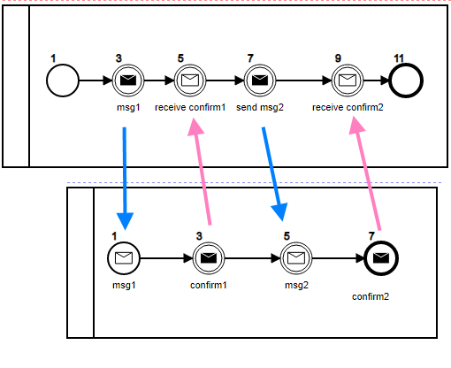

```
/// Old
/// -------------------------------------------------------
/// New
```

### Service Task

In Process definition (.bpmn file), use `implementation` attribute to define name of JavaScript/TypeScript Method to perform the Task:

```ts
<bpmn:serviceTask id="serviceTask" name="Service Task" implementation="service1">
  ...
</bpmn:serviceTask>
```

```ts

```

### Script Task

```ts
    <bpmn:scriptTask id="scriptTask" name="Script Task">
      <bpmn:script><![CDATA[

        this.log('testing from the inside: '+this.data.loopKey);

        ]]></bpmn:script>
    ..
    </bpmn:scriptTask>
/// Old
/// -------------------------------------------------------
/// New
      <bpmn2:script>
		this.log('testing from &lt;testing&gt; the inside: '+this.data.loopKey);
	  </bpmn2:script>
```

### Conditional Flow

```ts
      <bpmn:conditionExpression xsi:type="bpmn:tExpression"><![CDATA[
      (this.needsCleaning=="Yes")
      ]]>
</bpmn:conditionExpression>
    </bpmn:sequenceFlow>

/// Old
/// -------------------------------------------------------
/// New
    <bpmn2:conditionExpression xsi:type="bpmn2:tFormalExpression" language="JavaScript">
		this.log('testing from the inside: '+this.data.loopKey);
	</bpmn2:conditionExpression>


```

### Input Fields

```ts
    <bpmn:userTask id="task_Buy" name="Buy">
      <bpmn:extensionElements>
        <camunda:formData>
          <camunda:formField id="needsRepairs" label="Repairs Required?" type="boolean" />
          <camunda:formField id="needsCleaning" label="Cleaning Required?" type="boolean" />
        </camunda:formData>
      </bpmn:extensionElements>

        ...
    </bpmn:userTask>
/// Old
/// -------------------------------------------------------
/// New
      <bpmn2:extensionElements>
        <camunda:formData>
          <camunda:formField id="FormField_12m93d7" label="needsRepairs" type="boolean" />
          <camunda:formField id="FormField_1n345m9" label="NeedsCleaning" type="boolean" />
        </camunda:formData>
      </bpmn2:extensionElements>

### Business Rule Task

Decision Table is called through
```ts
    <bpmn2:businessRuleTask id="Task_1lcamp6" name="Vacation"  camunda:decisionRef="Vacation">
```

This will load the file 'Vacation.json' form the Processes folder as defined in configuration.js

### Script Extensions

Script Extensions are supported in release 1.1 and later, allowing you to add a script to any node.

In this example we are adding a script to bpmn:startEvent

```ts

    <bpmn:startEvent id="StartEvent_1ohx91b">
      <bpmn:extensionElements>
        <camunda:script event="start"><![CDATA[
        console.log("This is the start event");
          this.applyInput({records:[1,2,3]});
          console.log(this.data);
          console.log("This is the start event");]]></camunda:script>
      </bpmn:extensionElements>
      <bpmn:outgoing>Flow_18xinq3</bpmn:outgoing>
    </bpmn:startEvent>

```

/// Old
/// -------------------------------------------------------
/// New - fixed , tested (loop)

      <bpmn2:extensionElements>
        <camunda:executionListener event="start">
          <camunda:script scriptFormat="JavaScript">
    		script1
    	  </camunda:script>
        </camunda:executionListener>
        <camunda:executionListener event="end">
          <camunda:script scriptFormat="JavaScript">
    		script2
    		</camunda:script>
        </camunda:executionListener>
      </bpmn2:extensionElements>

### Timer Event

```ts
    <bpmn:intermediateCatchEvent id="Event_timer">
      <bpmn:incoming>Flow_1sg7v2d</bpmn:incoming>
      <bpmn:outgoing>Flow_1nku8og</bpmn:outgoing>
      <bpmn:timerEventDefinition id="TimerEventDefinition_07xu06a">
        <bpmn:timeDuration xsi:type="bpmn:tExpression">PT2S</bpmn:timeDuration>
      </bpmn:timerEventDefinition>
    </bpmn:intermediateCatchEvent>


More on [timers](./timers.md)
### Multi-instances Tasks

```ts
    <bpmn:scriptTask id="scriptTask" name="Script Task">
      <bpmn:incoming>Flow_159xzcz</bpmn:incoming>
      <bpmn:outgoing>Flow_0t7z2os</bpmn:outgoing>
      <bpmn:multiInstanceLoopCharacteristics isSequential="true" camunda:collection="(this.records)" />
      <bpmn:script><![CDATA[this.token.log('testing from the inside: '+this.token.data.loopKey);]]></bpmn:script>
    </bpmn:scriptTask>
```

### Input-Output

```xml
    /// to do
    /// ------
      <bpmn2:extensionElements>
        <camunda:inputOutput>
    		<camunda:inputParameter name="Input_1">
    			'someText'+data.var1
    		</camunda:inputParameter>
    		<camunda:outputParameter name="out1">
    			jsFunct(data.var1)+'myText'
    		</camunda:outputParameter>
        </camunda:inputOutput>
      </bpmn2:extensionElements>


      <bpmn2:extensionElements>
        <camunda:executionListener event="start">
          <camunda:script scriptFormat="JavaScript">
    		// preparing input for Service Call
    		input.variable1=data.myVar1
    		// now service call will be called as such
    		//		output=service(input values)
    	  </camunda:script>
        </camunda:executionListener>
        <camunda:executionListener event="end">
          <camunda:script scriptFormat="JavaScript">
    		// processing output from Service Call
    		data.myVar2=output.variable2
    	  </camunda:script>
        </camunda:executionListener>
```

### Call Process

```ts
<bpmn:callActivity id="activity_call" name="Call Task" calledElement="loop">
  ...
</bpmn:callActivity>
```

In the above example 'loop' is the name of process to be called.

### Throwing and Cathcing Messages

In this example, we will demonstrate how can two seperate processes communicate through "Messages"

#### 1 Throw a message with data

When a process throw a message, bpmn-server checks if there is another process that can catch this message before dispatching it to AppDelegate.

```xml
    <bpmn2:intermediateThrowEvent id="throw_msg1" name="msg1">
      <bpmn2:messageEventDefinition id="messageEventDef1" messageRef="Msg1" />
      <bpmn2:extensionElements>
        <camunda:script event="transformOutput"><![CDATA[
        this.context.response.output={caseId: this.token.data.caseId};
        this.context.response.messageMatchingKey={'data.caseId': this.token.data.caseId };
        ]]></camunda:script>
      </bpmn2:extensionElements>
      ...
    </bpmn2:intermediateThrowEvent>
```

The above will through a messsage as follows:

- Message Id: `Msg1`
- Message Output: `caseId: <someValue>`

#### 2 Catch a message with data

The second process defines a start event to catch the message `Msg1`

```ts
<bpmn2:startEvent id="StartEvent_1w66wpl" name="msg1">
  ...
  <bpmn2:messageEventDefinition id="messageEventDef4" messageRef="Msg1" />
</bpmn2:startEvent>
```

Therefore, the system will create a new instance of the second process and assign the Message output data, namely, the caseId

#### 3 Throw a message with data and a Key

In addition, the second process sends a confirmation message `Confirm1` to the first process

```ts
    <bpmn2:intermediateThrowEvent id="throw_confirm1" name="confirm1">
      <bpmn2:messageEventDefinition id="messageEventDef2" messageRef="Confirm1" />
      <bpmn2:extensionElements>
        <camunda:script event="transformOutput"><![CDATA[
        this.context.response.output={confirm: true};
        this.context.response.messageMatchingKey={'data.caseId': this.token.data.caseId };
        ]]></camunda:script>
      </bpmn2:extensionElements>
        ...
    </bpmn2:intermediateThrowEvent>
```

Howerver, the challenge here is that make sure the message is sent to the specific instance, that is where the Matching key is used

- Message Id: `Confirm1`
- Message Output: `confirm: true`
- Message Matching Keyt: 'data.caseId': this.token.data.caseId

```ts

```



### Input and Output Data Handling

```ts
    <bpmn2:serviceTask id="Task_1gpov6r" name="add" implementation="add">

      <bpmn2:extensionElements>
        <camunda:script event="transformOutput"><![CDATA[
        this.context.response.output={v1: this.data.v1 , v2: this.data.v2};
        ]]></camunda:script>
        <camunda:script event="transformInput"><![CDATA[
        this.data.result=this.context.response.input;
        ]]></camunda:script>
      </bpmn2:extensionElements>

      <bpmn2:incoming>SequenceFlow_0cr3d6e</bpmn2:incoming>
      <bpmn2:outgoing>SequenceFlow_1kdq5qw</bpmn2:outgoing>
    </bpmn2:serviceTask>
```

AppDelegate.ts has a service:

```ts
    async add({ v1, v2 }) {
        console.log("Add Service");
        console.log(v1, v2);
        return v1 + v2;
    }
```

    To test the above:

```ts
const server = new BPMNServer(configuration, logger, { cron: false });
let response = await server.engine.start('serviceTask', { v1: 1, v2: 2 });
console.log(response.instance.data);
```

Output:

```json
{ v1: 1, v2: 2, result: 3 }
```
