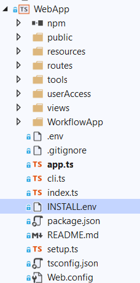

# Integration into your Application
In this document, we discuss how to integrate your application with bpmn-server.

**bpmn-server** package is a NodeJs package requires an application as a front-end and to customize the workflow logic

We provide a sample demo application in **[bpmn-web](https://github.com/bpmnServer/bpmn-web)** as a github template

To deliver a complete workflow, you need to customize the bpmn-web to suite your needs or you can have your own app to be the front-end of the workflow.

We assume that you are already familiar with setting up bpmn-server along with your processes and having them running.

Please note code in this page is for illustration purposes only.

## Workflow Application Components

### UI and User Authentication

In the demo app:
- root files
- Web Files; views, routes, public

### Workflow app

<table>
<tr><td>Folder    </td><td>Class    </td><td>   </td></tr>
<tr><td>WorkflowApp    </td><td>    </td><td>   </td></tr>
<tr><td>    </td><td>

[configuration](api/classes/Configuration.md)

</td><td>
Entry point to application configuration parameters and defining various components used in the workflow app   
</td></tr>
<tr><td>    </td><td>

[appDelegate](api/classes/DefaultAppDelegate.md)

</td><td>   </td></tr>
<tr><td>    </td><td>appServices</td><td>Receives Service Calls  </td></tr>
<tr><td>    </td><td>appUtils</td><td>Provide common methods to application scripts   </td></tr>
<tr><td>    </td><td>    </td><td>   </td></tr>
</table>

This is your custom installation of bpmn-server 

# Putting it Togother

## Use Case 1: Staging a Process
In this use case a User invokes some business logic that requires a process start ...
When a process reaches a User Task it issues a notification to user(s).

## Use Case 2: Invoking an Oustatnding Tasks

