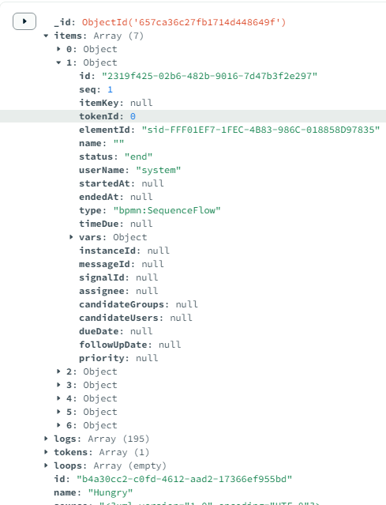
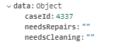
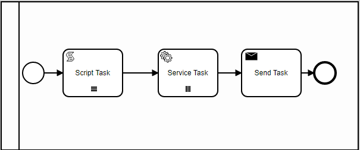
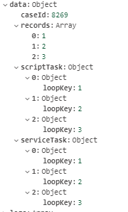

# Managing Data

<!-- toc -->

  - [Introduction](#introduction)
  - [Instance Object](#instance-object)
- [instance.data Scope](#instancedata-scope)
- [Data Query](#data-query)
  - [Item Query](#item-query)
  - [Instance Query](#instance-query)
- [Input-Output Data](#input-output-data)
  - [Input/Output using Scripts](#inputoutput-using-scripts)
  - [Input/Output using Camunda Extension of Input/Output Parameter](#inputoutput-using-camunda-extension-of-inputoutput-parameter)

<!-- tocstop -->

## Introduction

`bpmn-server` relies on a Database to store workflow information.
This makes it suitable for long-running workflows and multi-servers.

Developers can query on data using [Data Query](#data-query)

'bpmn-server' manages three collections in MongoDB:

<table> 
<tr><td>wf_instances</td><td> stores workflow instances, including items, tokens, logs ,etc. </td></tr>

<tr><td>wf_models</td><td> stores workflow models, this is important for querying on events</td></tr>

<tr><td>wf_locks</td><td> to achieve concurrency, running instances place a lock in this collection</td></tr>
</table>


[api.data object](api/interfaces/IAPIData.md) provides several methods to handle  workflow instances and items

While [api.model object](api/interfaces/IAPIModel.md) provides methods to access workflow models

In addition to saving bpmn specific properties, `bpmn-server` supports the following data elements:

- Presistent Data
  - instance.data 
  - item.vars
- In-Memory Data
  - item.input
  - item.output

All of the above all available during process execution and event listeners.

## Instance Object


The instance object is similar to: 

```json
instance: {
  id;
  name;
//.. other instance attributes
  items: { // items here
    id;
    elementId;
    status;
    vars;
    // items here
  }
  data: { // data attributes here}

  }
```




### instance.data Scope

The entire execution will have one data scope object, shared among all nodes, except the following will have own item part of the data object

- SubProcess
- and Loops (Multi-instances)



However, for SubProcess and Loop elements a seperate scope




## Data Query

The syntax follows MongoDB standards.

the query syntax must be
- instance attributes unqualified
- item attributes are qualified by `items.\<attributeName\>`
- data attributes are qualified by `data.\<attributeName\>`


### Item Query

| example                                                        | will retrieve                              |
| -------------------------------------------------------------- | ------------------------------------------ |
| `{ "items.id": "value-of-id" }`                                | find items by id only - unique             |
| `{ id: instanceId, "items.elementId": 'Approve' }`        | find items by instance id and elementId    |
| `{"data.caseId": caseId ,"items.elementId" : 'Request' }` | find items by caseId and item elementId    |
| `{ "name" : "Leave Application" , "items.status": "wait"}`           | find items for the process in a wait state |
| `{ id: instanceId, "items.status": 'wait' }`                   | check for items in "wait"                  |
| `{"items.status": "wait" , "items.elementId": "task_Buy" }`    | find all items that has "wait" status      |

```ts

items = await api.data.findItems({ "items.id": item.id  , "items.status": "wait"});
```
`findItems` performs the following 
- Adds security conditions

- Parses the query and converts it to MongoDB syntax

- Issue mongoDB query; mongoDb returns instances (not items)

- Filters the items and converts object into items

As an example if the api calls

 -  findItems query: ```{"id":"e213ff1b-bb09-43cf-9392-665036903a2c","items.elementId":"task_clean"} ```
 -  it converts to: ```{"id":"e213ff1b-bb09-43cf-9392-665036903a2c","items":{"$elemMatch":{"elementId":"task_clean"}}} ```
 -  returns on instance with several items
 -  it filters the items and returns only the 1 item as required

### Instance Query

Instance Queries are similar to Items Query but return entire Instances with all the items

```ts
// find instances having elementId

instances = await api.data.findInstances({
  'items.elementId': 'task_Buy',
});

//  find instance by itemd id

instances = await api.data.findInstances({ 'items.id': item.id });

// find instance by caseId

instances = await api.data.findInstances({ 'data.caseId': 3030 });
```

## Input-Output Data

Input and output is used in the following scenarios:

- Subprocess (input/output)
- Service Tasks (input/output)
- Call Tasks (input/output)
- Throw Message/Signal (input)
- Catch Message/Signal (output)
- User Task (input)

### Input/Output using Scripts

| variable        | description                                                         |
| --------------- | ------------------------------------------------------------------- |
| **data**   | refers to Instance Data or the token data for multi-instance tokens |
| **item.input**  | refers to input variable into the called task/event                 |
| **item.output** | is the output of the called task/event                              |

```xml
    <bpmn2:serviceTask id="Activity_00ticbc" name="Add 2 Using scripts" implementation="add" camunda:delegateExpression="add">
        <bpmn2:extensionElements>
        <camunda:executionListener event="start">
          <camunda:script scriptFormat="JavaScript">

            item.input.v1=33;
            item.input.v2=25;

          </camunda:script>
        </camunda:executionListener>
        <camunda:executionListener event="end">
          <camunda:script scriptFormat="JavaScript">

            item.data.result2= item.output + 100;

          </camunda:script>
        </camunda:executionListener>
      </bpmn2:extensionElements>

```

### Input/Output using Camunda Extension of Input/Output Parameter

```xml
    <bpmn2:serviceTask id="Task_0xh2iwa" name="service1" implementation="service1">
      <bpmn2:extensionElements>
        <camunda:inputOutput>
          <camunda:inputParameter name="repeat">item.data.count</camunda:inputParameter>
          <camunda:outputParameter name="sequence">this.output.seq</camunda:outputParameter>
          <camunda:outputParameter name="returnText">'out text:'+this.output.text</camunda:outputParameter>
        </camunda:inputOutput>
      </bpmn2:extensionElements>
```

- parameter name is the name of variable
- value is a JavaScript expression

| Scenario     | before call                              | caller Syntax           | after call                                              |
| ------------ | ---------------------------------------- | ----------------------- | ------------------------------------------------------- |
| Throw Msg    | parameters.var1= '123';<br />output.var1 | throw(msg,parameters)   | -                                                       |
| Catch Msg    | -                                        | catch(msg,parameters)   | data.var1= parameters.var1;                             |
| Call Process | parameters.var1= '123';                  | result=call(parameters) | data.var1= result.var1;                                 |
| Service Call | parameters.var1= '123';                  | result=call(parameters) | data.var1= result.var1;                                 |
| Start Event  | -                                        | start(parameters)       | data.var1= parameters.var1;<br /> data.var1=input.var1; |

- Call
  specs:

```mermaid
        input:
            var1    ->  data.myVar1
            var2    ->  5

        output:
            scenario 1:
            result  ->  <nothing>
            scenario 2:
            result  ->  output.result

  on-entry:
        item.input.var1= 51;

  on-run:
        item.output=call fun(item.input)

  on-exit:

        scenario 1:
        data.result  = item.output;
        scenario 2:
        data.result  = item.output.result;
```

- Throw

```mermaid
    specs:

    output:

            caseId  ->  data.caseId

    on-entry:

         item.output.caseId= data.caseId;

    on-call:

        throw (signal,item.output)
```

- Catch

```mermaid
    specs:  none

    start trigger:

            data.caseId=input.caseId;
```

- Start

```mermaid
    specs:  none

    start trigger:

            data.caseId=input.caseId;
```
