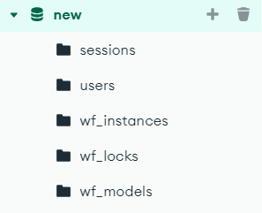

# Data Query

Since instance data is saved in a MongoDB database by default, 'bpmn-server' provides facilities to query the data.

'bpmn-server' manages three collections in MongoDB:

<table> <tr><td> 

- wf_instances; stores workflow instances, including items, tokens, logs ,etc.

- wf_models; stores workflow models, this is important for querying on events

- wf_locks; to achieve concurrency, running instances place a lock in this collection

</td><td>



</td></tr></table>


[api.data object](api/interfaces/IAPIData.md) provides several methods to query on instances and items

The syntax follows MongoDB standards.

the query syntax must be
- instance attributes unqualified
- item attributes are qualified by 'items.<attributeName>'
- data attributes are qualified by 'data.<attributeName>'

```

## Item Query

| example                                                        | will retrieve                              |
| -------------------------------------------------------------- | ------------------------------------------ |
| `{ "items.id": "value-of-id" }`                                | find items by id only - unique             |
| `{ id: instanceId, "items.elementId": item.elementId }`        | find items by instance id and elementId    |
| `{"data.caseId": caseId ,"items.elementId" : item.elementId }` | find items by caseId and item elementId    |
| `{ "name" : "processName" , "items.status": "wait"}`           | find items for the process in a wait state |
| `{ id: instanceId, "items.status": 'wait' }`                   | check for items in "wait"                  |
| `{"items.status": "wait" , "items.elementId": "task_Buy" }`    | find all items that has "wait" status      |

```ts
query = { 'items.id': item.id };
items = await api.data.findItems(query);
```
`findItems` performs the following 
- Adds security conditions

- Parses the query and converts it to MongoDB syntax

- Issue mongoDB query; mongoDb returns instances (not items)

- Filters the items and converts object into items

As an example if the api calls

 -  findItems query: ```{"id":"e213ff1b-bb09-43cf-9392-665036903a2c","items.elementId":"task_clean"} ```
 -  it converts to: ```{"id":"e213ff1b-bb09-43cf-9392-665036903a2c","items":{"$elemMatch":{"elementId":"task_clean"}}} ```
 -  returns on instance with several items
 -  it filters the items and returns only the 1 item as required

## Instance Query

Instance Queries are similar to Items Query but return entire Instances with all the items

```ts
// find instances having elementId

instances = await api.data.findInstances({
  'items.elementId': 'task_Buy',
});

//  find instance by itemd id

instances = await api.data.findInstances({ 'items.id': item.id });

// find instance by caseId

instances = await api.data.findInstances({ 'data.caseId': 3030 });
```
