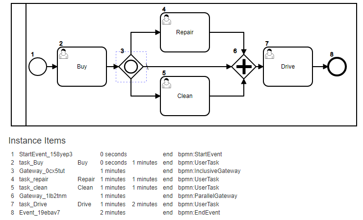

# Buy Used Car Example:


For the model above we will walk-through how to execute it programaticaly.


```javascript
const config = require('../configuration.js').configuration;
const Server = require("../src/BPMNServer");

const DefaultLogger = require('../src/DefaultLogger.js').DefaultLogger;


test();
async function test() {

    const logger = new DefaultLogger({ toConsole: false });

    let server= new Server.BPMNServer(config, logger);

    let execution,  instance, items;
    let name = 'Buy Used Car';

    console.log('Executing the Process:' + name);
    execution = await server.execute(name, 'rhanna', { caseId: 999 });

    engine = execution.engine;
    instance = execution.instance;


    instance.getItems({ status: 'wait' }).forEach(item => {
        console.log(`  waiting for ${item.name} `);
    });


    console.log('Invoking Buy');
    execution = await server.invoke({
                instanceId: execution.instance.id, status: 'wait', name: 'Buy'
            }, 'ralph'
             , { model: 'Thunderbird',repairsRequired: true, cleaningRequired: false });

    instance.getItems({ status: 'wait' })
        .forEach(item => {
            console.log(`  waiting for ${item.name} `);
        });


    console.log('Invoking Clean');
    execution = await server.invoke({
                instanceId: execution.instance.id, status: 'wait', name: 'Clean'
            });

    instance.getItems({ status: 'wait' })
        .forEach(item => {
            console.log(`  waiting for ${item.name} `);
        });


    console.log('Invoking Repair');
    execution = await server.invoke({
                instanceId: execution.instance.id, status: 'wait', name: 'Repair'
        });

        
    instance.getItems({ status: 'wait' })
        .forEach(item => {
            console.log(`  waiting for ${item.name} `);
        });


    console.log('Invoking Drive');
    execution = await server.invoke({
         instanceId: execution.instance.id, status: 'wait', name: 'Drive'
        });


    instance.getItems({ status: 'wait' })
            .forEach(item => {
                console.log(`  waiting for ${item.name} `);
            });

    console.log('-- all done now - let us see the status:')
    instance.getItems({ status: 'wait' })
            .forEach(item => {
                console.log(`  waiting for ${item.name} `);
        });

    console.log('-- now let us query from the DB using CaseId ');

    items = await server.findItems({ instanceId: instance.id, data: { caseId: 999 } } );

    instance.getItems({ status: 'wait' })
            .forEach(item => {
                console.log(`  waiting for ${item.name} `);
        });

    console.log("Engine Status is now : "+ execution.engine.state);


}

```
The instance Items should look like this:


