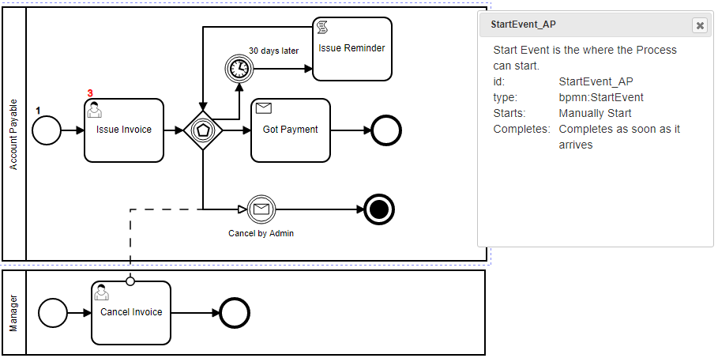
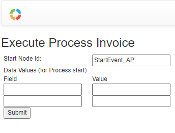

<!-- toc -->

- Invoking Workflow Examples
  - [Buy Used Car - Using WebApp ](./examples/BuyCar-Web.md)
  - [Buy Used Car - Using API](./examples/BuyCar-Server.md)
  - [Buy Used Car - Remotely Using WebServices](./examples/BuyCar-Remote.md)
  - [Async Execution](#async-execution)
- Process Definitions Examples
  - [Service Task](#service-task)
  - [Script Task](#script-task)
  - [Conditional Flow](#conditional-flow)
  - [Input Fields](#input-fields)
  - [Multiple Start Event](#multiple-start-event)
  - [Business Rule Task](#business-rule-task)
  - [Script Extensions](#script-extensions)
  - [Timer Event](#timer-event)
  - [Multi-instances Tasks](#multi-instances-tasks)
  - [SubProcess](#subprocess)
  - [Call Process](#call-process)
  - [Message Flow](#message-flow)
  - [Throwing and Cathcing Messages](#throwing-and-cathcing-messages)
  - [Input and Output Data Handling](#input-and-output-data-handling)
  - [Gateway](./examples/gateway.md)
  - [Event Based Gateway ](./examples/gateway.md)
  - [Boundary Events](./examples/boundary-events.md)

<!-- tocstop -->

## Invoking Proccess through API

To Invoke a process from your code:

```javascript
    const { configuration }  = require('../configuration.js');
    const { BPMNServer, Logger } = require('bpmn-server');

    const logger = new Logger({ toConsole: true });

    const server = new BPMNServer(configuration, logger);

    let response = await server.engine.start('Buy Used Car');

    const items = response.items.filter(item => {
        return (item.status == 'wait');
    });

    items.forEach(item => {
        console.log(`  waiting for <${item.name}> -<${item.elementId}> id: <${item.id}> `);
    });
    const itemId = items[0].id;

    console.log(`Invoking Buy id: <${itemId}>`);

    const input={ model: 'Thunderbird', needsRepairs: false, needsCleaning: false };
    response = await engine.invoke({items: { id: itemId } }, input );

    console.log("Ready to drive");

```
### Async Execution
```js
    const logger = new Logger({ toConsole: false });

    const listener = new EventEmitter();

    listener.on('all', function ({ context, event, }) {
        let msg = '';
        if (context.instance.id)
            msg = ' instanceId: ' + context.instance.id;
        if (context.item)
            msg += ' Item: ' + context.item.elementId + " itemId: "+ context.item.id;
        console.log('---Event: -->' + event + msg );
    });

    const server = new BPMNServer(configuration, logger, { cron: false });

    // notice no await for next line
    server.engine.start('serviceTask', { v1: 1, v2: 2 }, listener);
```
In the above example; engine.start return immediatly, but a listener keep track of all event 

## Process Definitions Examples

### Service Task
In Process definition (.bpmn file), use `implementation` attribute to define name of JavaScript/TypeScript Method to perform the Task:


```xml
    <bpmn:serviceTask id="serviceTask" name="Service Task" implementation="service1">
    ...
    </bpmn:serviceTask>
```

```js 
class MyAppDelegate extends DefaultAppDelegate{

    // for services that are not defined
    async serviceCalled(item) {
        
    }
    async service1(item) {
        seq++;
        await delay(3000 -(seq * 100) , 'test');
        item.log("SERVICE 1" + item.token.currentNode.id);
    }
}

```
### Script Task


```xml
    <bpmn2:scriptTask id="Activity_06typtl" name="script" scriptFormat="JavaScript">
      <bpmn2:script>
        
       this.log('testing from &lt;testing&gt; the inside: '+data.loopKey);
      </bpmn2:script>
 ..
    </bpmn2:scriptTask>
```


### Conditional Flow


```xml

  <bpmn:sequenceFlow>    

   <bpmn:conditionExpression xsi:type="bpmn:tFormalExpression" language="JavaScript">
      (data.needsCleaning=="Yes")
   </bpmn:conditionExpression>
  ..

```
### Form Input Fields


```xml
    <bpmn:userTask id="task_Buy" name="Buy">
      <bpmn:extensionElements>
        <camunda:formData>
          <camunda:formField id="needsRepairs" label="Repairs Required?" type="boolean" />
          <camunda:formField id="needsCleaning" label="Cleaning Required?" type="boolean" />
        </camunda:formData>
      </bpmn:extensionElements>
        ...
    </bpmn:userTask>    

```
### Multiple Start Event



When a definition/process has multiple start node, you need to specify the start node when starting the process:

From the Web UI:



From API:
```js
    
    response = await server.engine.start('invoice', 
        { reminderCounter: 0, caseId: caseId}, null, 'StartEvent_AP');
```
### Business Rule Task

BPMN-Server supports Business Rules implemented through DMN-Engine
Business Rules can be defined as a Decision Table as in this example:


Decision Table is called through 
```js
    <bpmn2:businessRuleTask id="Task_1lcamp6" name="Vacation"  camunda:decisionRef="Vacation">
````
This will load the file 'Vacation.json' form the Processes folder as defined in configuration.js

### Script Extensions

Scripts can be added to listen to two events:
- Start before the Task is executed
- End after the task is executed


In this example we are adding a script to bpmn:startEvent

```xml
    <bpmn2:extensionElements>
      <camunda:executionListener event="start">
        <camunda:script scriptFormat="JavaScript">
          
           console.log("This is the start event");
          data.records=[1,2,3];
          console.log(data);

        </camunda:script>
      </camunda:executionListener>
      <camunda:executionListener event="end">
        <camunda:script scriptFormat="JavaScript">
          
          console.log("This is the end event");          


          </camunda:script>
      </camunda:executionListener>
    </bpmn2:extensionElements>

   
```


### Timer Event


```xml
    <bpmn:intermediateCatchEvent id="Event_timer">
      <bpmn:incoming>Flow_1sg7v2d</bpmn:incoming>
      <bpmn:outgoing>Flow_1nku8og</bpmn:outgoing>
      <bpmn:timerEventDefinition id="TimerEventDefinition_07xu06a">
        <bpmn:timeDuration xsi:type="bpmn:tExpression">PT2S</bpmn:timeDuration>
      </bpmn:timerEventDefinition>
    </bpmn:intermediateCatchEvent>
```
More on [timers](./timers.md)
### Multi-instances Tasks


```xml
    <bpmn:scriptTask id="scriptTask" name="Script Task">
      <bpmn:incoming>Flow_159xzcz</bpmn:incoming>
      <bpmn:outgoing>Flow_0t7z2os</bpmn:outgoing>
      <bpmn:multiInstanceLoopCharacteristics isSequential="true" camunda:collection="(data.records)" />
      <bpmn:script><![CDATA[this.log('testing from the inside: '+data.loopKey);]]></bpmn:script>
    </bpmn:scriptTask>
```
For Multi-instance data handling [see](./data.md)

### Call Process


```xml
    <bpmn:callActivity id="activity_call" name="Call Task" calledElement="loop">
    ...
    </bpmn:callActivity>

```
In the above example 'loop' is the name of process to be called.
### Message Flow
```js
```

### Throwing and Cathcing Messages
In this example, we will demonstrate how can two seperate processes communicate through "Messages"


#### 1 Throw a message with data
When a process throw a message, bpmn-server checks if there is another process that can catch this message before dispatching it to AppDelegate.

```xml
    <bpmn2:intermediateThrowEvent id="throw_msg1" name="msg1">
      <bpmn2:messageEventDefinition id="messageEventDef1" messageRef="Msg1" />
      <bpmn2:extensionElements>
        <camunda:script event="start"><![CDATA[
        input.caseId= data.caseId;
        this.messageMatchingKey={'data.caseId': data.caseId };
        ]]></camunda:script>
      </bpmn2:extensionElements>
      ...
    </bpmn2:intermediateThrowEvent>
```
The above will through a messsage as follows:
- Message Id:             `Msg1`
- Message Output:         `caseId: <someValue>`

#### 2 Catch a message with data
The second process defines a start event to catch the message `Msg1`
```xml
    <bpmn2:startEvent id="StartEvent_1w66wpl" name="msg1">
      ...
      <bpmn2:messageEventDefinition id="messageEventDef4" messageRef="Msg1" />
    </bpmn2:startEvent>

```
Therefore, the system will create a new instance of the second process and assign the Message output data, namely, the caseId

#### 3 Throw a message with data and a Key

In addition, the second process sends a confirmation message `Confirm1` to the first process
```xml
    <bpmn2:intermediateThrowEvent id="throw_confirm1" name="confirm1">
      <bpmn2:messageEventDefinition id="messageEventDef2" messageRef="Confirm1" />
      <bpmn2:extensionElements>
        <camunda:script event="transformOutput"><![CDATA[

        this.output.confirm=true;
        this.context.messageMatchingKey={'data.caseId': this.token.data.caseId };

        ]]></camunda:script>
      </bpmn2:extensionElements>
        ...
    </bpmn2:intermediateThrowEvent>
```

Howerver, the challenge here is that make sure the message is sent to the specific instance, that is where the Matching key is used
- Message Id:             `Confirm1`
- Message Output:         `confirm: true`
- Message Matching Keyt:   'data.caseId': this.token.data.caseId 

```js
```


### Input and Output Data Handling

[this for details](data.md#Input-Output_Data)

