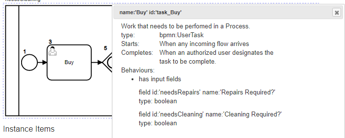
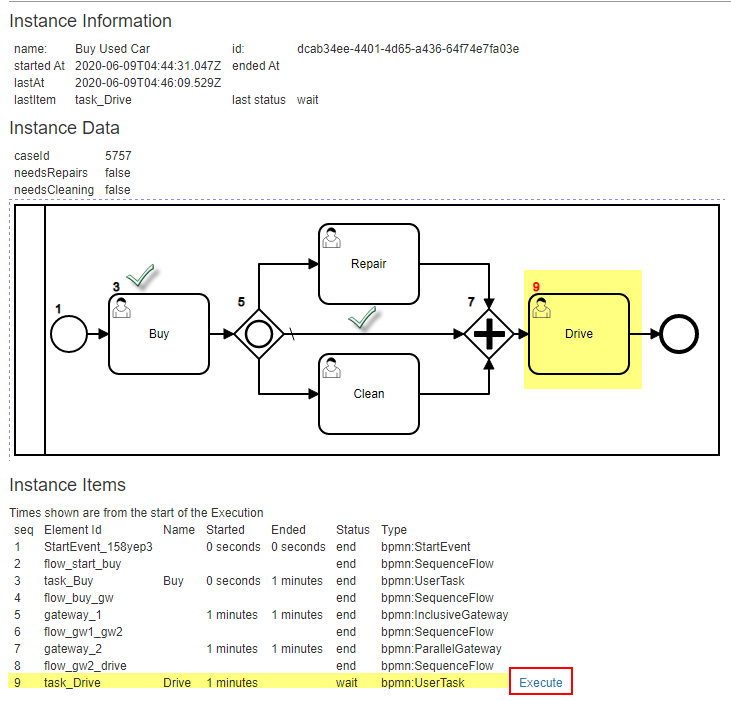

# Buy Used Car Example using the Web App:

## 1 Select Process - Execute
From the WebApp home page:
- Select the Process
- Click [Execute] link

- will start the process and redirect you to an Instance Details page

## 2 Invoke 'Buy' Task

- The process has started and waiting at the task 'Buy'
- So, let us go for it

## 3 Prompt for Input

Oh, what is that? It knows that this task requires some input!!

Cool, so let us provide some data and submit

To be sure, let us click on the node on the diagram to get more details:

A popup window will show us various details about the node from the BPMN defintion.

## 4 Let us 'Drive'

Ok, since we stated that the car is clean and requires no repairs, it skips those steps.

We are now ready to drive and enjoy!

## 5 Congrats!
The process is now Complete.

We also have a complete audit of what happened and why!

