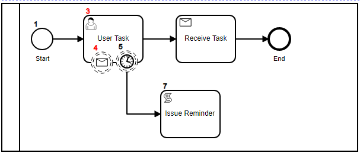

# Boundary Events:

- Boundary Events start with the owner Activity
- Are cancelled when the the owner activity is completed
- Intrupting BoundaryEvent, when complete they cancel (Intrupt) the owner
- Non-Intrupting BoundaryEvent they fire without impacting the owner


```ts

const { BPMNServer, DefaultHandler, Logger } = require("../../");
const { configuration } = require('../../configuration');


const logger = new Logger({ toConsole: false });

const server = new BPMNServer(configuration, logger);
var caseId = Math.floor(Math.random() * 10000);

let name = 'boundary-event';
let response;
let instanceId;

Feature('Boundary Event', () => {
```
## Do the task right-away
```ts
        Scenario('do the task right-away- events will cancel', () => {
            Given('Start '+ name + ' Process',async () => {
                response = await server.engine.start(name, {});
            });
            Then('check for output', () => {
                expect(response).to.have.property('execution');
                instanceId = response.execution.id;
                expect(getItem('user_task').status).equals('wait');
                expect(getItem('BoundaryEvent_timer').status).equals('wait');
                expect(getItem('BoundaryEvent_message').status).equals('wait');
            });
```


boundary events have started in a wait state
```ts

            When('I invoke user_task', async () => {

                const data = { };
                const query ={
                   id: instanceId ,
                    "items.elementId" : 'user_task' };
                response= await server.engine.invoke(query ,data );
            });
```


Events are terminated.
```ts

            When('I dont wait for events to complete', async () => {

                expect(getItem('BoundaryEvent_timer').status).equals('end');
                expect(getItem('BoundaryEvent_message').status).equals('end');

            });

            let fileName = __dirname + '/../logs/'+ name +'1.log';

            and('write log file to ' + fileName, async () => {
              logger.save(fileName);
            });
        });
```
## Don't do the task right-away , wait for timer to fire
```ts
            Scenario('Dont do the task right - away, wait for timer to fire', () => {
                Given('Start ' + name + ' Process', async () => {
                    response = await server.engine.start(name, {});
                });
                Then('check for output', () => {
                    expect(response).to.have.property('execution');
                    instanceId = response.execution.id;
                    expect(getItem('user_task').status).equals('wait');
                    expect(getItem('BoundaryEvent_timer').status).equals('wait');
                    expect(getItem('BoundaryEvent_message').status).equals('wait');
                });
```


boundary events have started in a wait state
```ts
            When('wait for the timer to fire', async () => {

                await server.cron.checkTimers();
                await delay(1500);
            });

```



```ts

            When('I wait for events to complete', async () => {

                expect(getItem('BoundaryEvent_timer').status).equals('end');
                expect(getItem('BoundaryEvent_message').status).equals('wait');
                expect(getItem('task_2').status).equals('end');     // issue reminder
                

            });

            let fileName = __dirname + '/../logs/' + name + '2.log';

            and('write log file to ' + fileName, async () => {
                logger.save(fileName);
            });

       });


    });

async function delay(time) {
    log("delaying ... " + time)
    return new Promise(function (resolve) {
        setTimeout(function () {
            log("delayed is done.");
            resolve();
        }, time);
    });
}
function log(msg) {
    logger.log(msg);
}
function getItem(id)
{
    return response.items.filter(item => { return item.elementId == id; })[0];
}
```