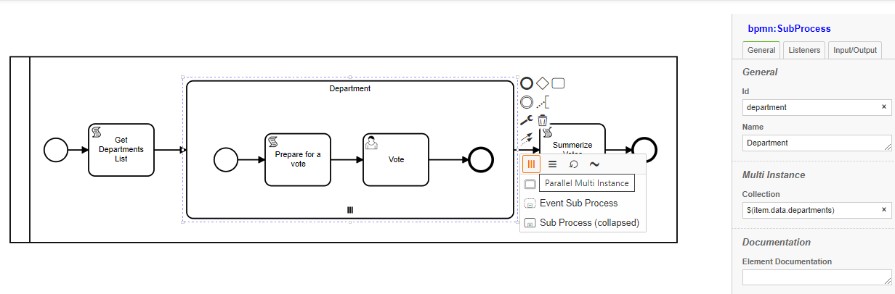

# Multi-instance Tasks (loops):

Any Task can have multi-instance either Sequential or Parrallel

Loops have a unique data structure to support multiple items for same node with each of unique data

We will use an example to illustrate the use of loops:
- We would like to conduct a poll on various departments about new projects coming up
- We will retrieve department list from a DB using `Get Department List` service task
- For each department will initiate a subProcess `department` with a multi-instance

## Defining loop collection

- Input Collection is defined as an Array, defines the multipicity of the node.
- Each value in the collection becomes a key to item



- Since we like to have various departments vote at any time, we make the multi-instance `parallel`
- Inside the subprocess instance will assign users and designate more information about the vote in `Prepare for a vote`
- A User Task `vote` to allow desigated users/user groups to vote with some input fields
- After all department complete their vote, another task `Summarize Votes` will process the results


## Data structure

- Each loop instance stores its own unique data elements, for subProcess loops data is shared among all node items inside the subprocess

So the data structure looks like:
>Loop name
>>Key
>>>data
```js
department: {
    IT: {
      scriptLog: 'added by script event,key:IT',
      votedBy: 'IT-User',
      vote: 85
    },
    HR: {
      scriptLog: 'added by script event,key:HR',
      votedBy: 'HR-User',
      vote: 100
    },
    Billing: {
      scriptLog: 'added by script event,key:Billing',
      votedBy: 'Billing-User',
      vote: 80
    }
  }
```
Any node inside the loop will share same data, so inside 'HR' 
```js
  console.log(item.data.vote,'for ',item.itemKey);
```
Will produce: `100 for HR`.

However, `Summarize Votes` task is outside the subprocess and at the root, so it has the instance data structure
So once you have access to instance data:
```ts
  Object.keys(item.data.department).forEach(key=>{
    console.log('Vote for:',key,item.data.department[key]['vote']);

  });
```
will produce:
```
Vote for: IT 100
Vote for: HR 85
Vote for: Billing 80
```
## Data Search

- During the execution, either through an event or a script/service task
```ts
    item.token.execution.getItems().filter(itm=>(itm.elementId=='Activity_vote')).forEach(voteItem=>{
        
        let vote =voteItem['data']['vote'];
        let dept=voteItem.itemKey;

        console.log("vote Item",voteItem.seq,'dept:',dept,'vote',vote);

    });
```

- In a detached fashion, like a batch job or remote access 
```ts
    let items=await api.data.findItems({"items.elementId":'Activity_vote',"data.caseId":1050});
    items.forEach(voteItem=>{
        
        let vote =voteItem['data']['vote'];
        let dept=voteItem.itemKey;

        console.log("vote Item",voteItem.seq,'dept:',dept,'vote',vote);

    });
```
- Search for a particular item by key:
```json
    let items=await api.data.findItems({"items.elementId":'Activity_vote',"items.itemKey":"HR"});
```