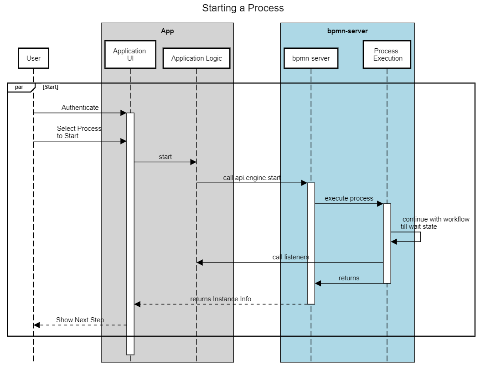
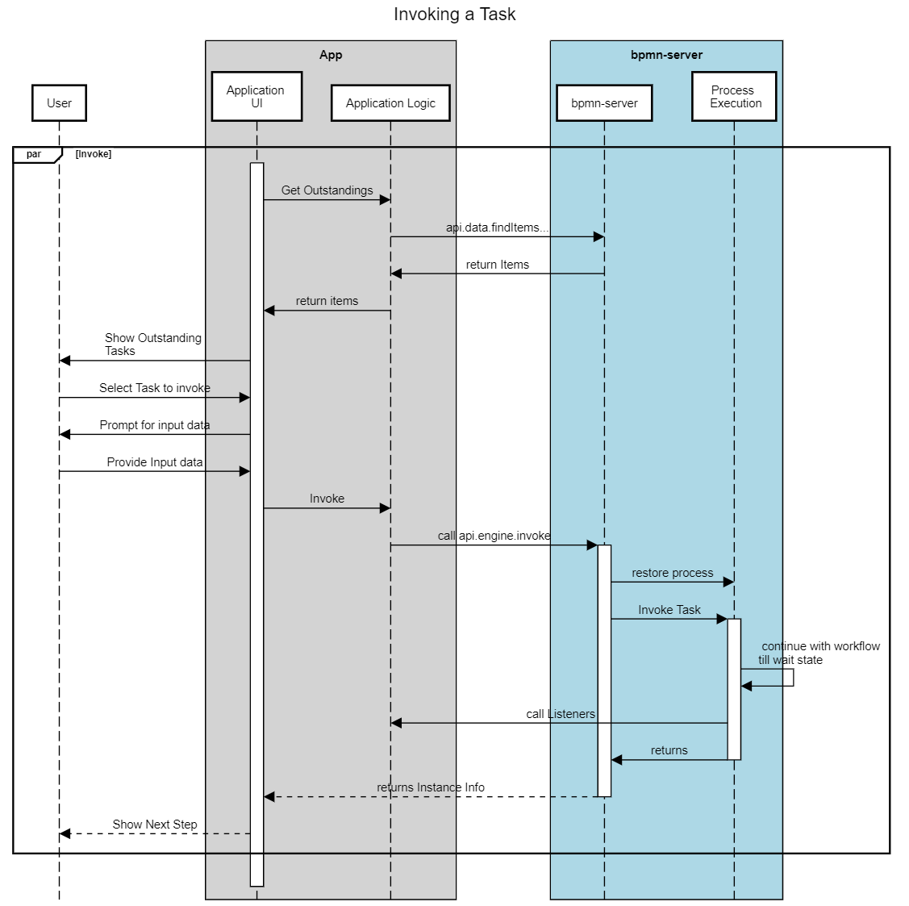

# Workflow Execution

Execution is based on the model logic that is enhanced by various extensions that allow scripting and access to your application.

During Execution, Model Listeners and Application Listeners are invoked.

Process Execution is performed based on BPMN 2.0 standards providing access to the following components to participate:
- Event Listener
- Scripts
- Services
- AppDelegate

See [more about scripts](scripting.md)

The execution `engine` is availabe through an API [see API.engine](api/interfaces/IAPIEngine.md).
## Starting a Process
For more details about scenarios of Invoking Execution Engine [Engine Invokation](invokation.md)

<table><tr><td>
This illustrate the flow of Model Execution:
Once the process goes into a **wait** state, it waits for some external input:

- User Input
- Message/Signal to be received
- Timer to expire

</td><td>



</td></tr></table>

## Invoking a User Task



## Execution Sequence

Below is the sequence of events after each command:

### engine.start

```
---Event: -->process.start { option1: 1234 }
=========== Process Start ===============

---Event: -->transformInput item: StartEvent_1 { option1: 1234 }
---Event: -->enter item: StartEvent_1 { option1: 1234 }
---Event: -->start item: StartEvent_1 { option1: 1234 }
---Event: -->process.saving { option1: 1234 }
---Event: -->end item: StartEvent_1 { option1: 1234 }
---Event: -->enter item: Request { option1: 1234 }
---Event: -->start item: Request { option1: 1234 }
---Event: -->wait item: Request { option1: 1234 }
---Event: -->process.wait { option1: 1234 }
---Event: -->process.saving { option1: 1234 }

```
### engine.assign
```
---calling assign-----

---Event: -->process.restored { option1: 1234, restored: true }
---Event: -->assign item: Request { option1: 1234, restored: true }
---Event: -->validate item: Request { option1: 1234, restored: true }
---Event: -->process.saving { option1: 1234, restored: true }
```

### engine.invoke
```

---calling invoke-----

---Event: -->process.restored { option1: 1234, restored: true }
---Event: -->process.invoke { option1: 1234, restored: true }
---Event: -->transformInput item: Request { option1: 1234, restored: true }
---Event: -->validate item: Request { option1: 1234, restored: true }
---Event: -->end item: Request { option1: 1234, restored: true }
---Event: -->enter item: Approve { option1: 1234, restored: true }
---Event: -->start item: Approve { option1: 1234, restored: true }
---Event: -->enter item: Event_1lkpj3z { option1: 1234, restored: true }
---Event: -->start item: Event_1lkpj3z { option1: 1234, restored: true }
---Event: -->wait item: Event_1lkpj3z { option1: 1234, restored: true }
---Event: -->wait item: Approve { option1: 1234, restored: true }
---Event: -->process.invoked { option1: 1234, restored: true }
---Event: -->process.saving { option1: 1234, restored: true }

```
## engine.invoke (with validation failure)

```
---invoke Approve-----

---Event: -->process.restored { option1: 1234, restored: true }
---Event: -->process.invoke { option1: 1234, restored: true }
---Event: -->transformInput item: Approve { option1: 1234, restored: true }
---Event: -->validate item: Approve { option1: 1234, restored: true }
---Event: -->process.error { option1: 1234, restored: true }
***************BPMNServer UNCAUGHT ERROR***********

Error Message: Error: Validation failed with error:Not a valid value
```


# Scope and variables
[See Scope and Variables in Scripts](scripting.md#Scripts_scope_and_variables)

# Scripts and Services Impact on Execution
Scripts and Services can impact workflow in the following manners:
- Change workflow Data
- Service Tasks and Script Tasks, receive input and return output
- Scripts and Service Task can raise Errors and Exceptions

# Raisng Errors , Escalations and Exceptions
## Validation Scripts
Validation Scripts can return an error as such:
```
    return {error:'Invalid input'};
```

As a result execution will raise an exception and the command will fail.

## BPMN Errors

All Scripts and Services can Raise `BPMN Errors`, to be handled by the appropriate Error node
```
    return {bpmnError:'error code'};

```
All Scripts and Services can Raise `BPMN Escalation`, to be handled by the appropriate Catch Escalation Event
```
    return {escalation:'escalation code'};

```
The current item status will be `error` and execution will continue at the Error node.

## Throwing Exceptions
```
    new error('error message');
```

This will raise an Excption, stop workflow execution and save the instance datatake action


