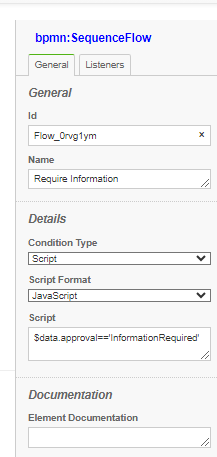

# Scripting

<!-- toc -->

  - [Introduction](#introduction)
  - [Model Expressions/Scripts](#model-expressionsscripts)
    - [Model Expressions](#model-expressions)
    - [Model Listeners](#model-listeners)
  - [Execution Listeners](#execution-listeners)
    - [Task Listeners](#task-listeners)
  - [Application Listener](#application-listener)
- [Scripts Scope and variables](#scripts-scope-and-variables)
  - [Item Scope](#item-scope)
  - [Execution Scope](#execution-scope)
  - [Application Listener](#application-listener)

<!-- tocstop -->

## Introduction
Scripting is using NodeJs `JavaScript` engine.
scripts have full access to the running working full, as well as your application logic in:
- AppDelegate class; as a general entry point
- AppServices class; that responds to Service Tasks
- AppUtils class; general purpose class to make your scripts more powerfull

Scripting is used to add logic to your workflow and is achieved by:

## Model Expressions/Scripts

### Model Expressions 

#### conditional flow examples:

<table>
<tr><td>



</td><td>


```
    data.approval=='Approved'
  or 
    (data.approval=='Approved')
    (this.data.v1 + this.data.v2)
    (this.data.v1 == this.data.v2)
    (this.data.v1 + this.data.v2)>0
    (this.data.v1 + this.data.v2)<4
    
```

</td></tr></table>

#### timers examples:
For duration timers
```
    $appServices.dateAdd(item.dateStarted,10,'days')
```   


#### Input/Output

<table>
<tr><th>Type</th><th>Example Value</th></tr>
<tr><td>Text/String</td><td>hello</td></tr>
<tr><td>List</td><td>[ 'str1', 'str2', item.data.myExistingVar ]</td></tr>
<tr><td>Map</td><td>\{ 'key1':  'val1', 'key2': 'val2' \}</td></tr>
<tr><td>JavaScript</td><td>data.item.myExistingVar</td></tr>
<tr><td>JavaScript</td><td>\{ 'key1': 'val1', 'key2': 'val2' , 'key3': [item.data.myExistingVar, 'hello'], 'key4': \{ 'ikey5': item.data.myExistingVar\}\}</td></tr>
</table>

#### Assignment properties

User Task Assignment properties can be JavaScript expression, in this case they must start with '$'

For example:

`assignee` 	`$(this.data.requester)`

### Model Listeners

Inside your model, you can attach Listeners to various nodes as `JavaScript Listeners`

These are similar to expressions above but can invoke async functions and can include more complete Javascript

No syntax required for these scripts

#### Examples
```
    let userManager=await appServices.retrieveManagerForUser(item.userName);

    data.manager=userManager;
    
    if (data.var1>5) {
        data.message='any text here';
    }
```
## Execution Listeners
These are for all node types and processes

<table>
<tr><td>


| event        |       Description        |
|-------------  |-------------   |
| start   |   is fired at the start of item execution|
| end   |	  is fired at the end of item execution|


Also at the process level, start and end are triggered

</td><td>


</td></tr></table>


### Task Listeners
<details>
<summary>
These are for User Tasks only
</summary>

| event        |       Description        |
|-------------  |-------------   |
| assign   |   invoked after `assign` command is issued |
| validate  |invoked after `assign` or `invoke`  command is issued|

`validate` scripts have a special handling, that they can stop execution by raising errors, to return errors to the execution:
```
    // do some checking here
    return {error:'Not a valid Input'};

```
As a result execution will raise an exception and the command will fail.

</details>

## Application Listener

You can place a listener in your application delegate or your execution scripts class to listen to all events
Example:
```
    const api = new BPMNAPI(new BPMNServer(configuration,new Logger({ toConsole: false}),{cron:false}));

    let options= {option1:1234}; //,option2:SystemUser};

    api.server.listener.on('all', async function ({ context, event, }) {
        if (event=='process.restored')
            {
            context.options=options;
            context.options['restored']=true;
            }
        if (event.startsWith('process.'))
            console.log('---Event: -->' + event , context.options);
        else 
            console.log('---Event: -->'+event, 'item:',context.item.elementId,context.options );
    });

```

# Scripts Scope and variables
## Item Scope
Items Expressions and Listeners have the following variables

| Variable        |       Description        |
|-------------  |-------------   |
| item   |   reference the current item	|
| this   |	same as item|
| data 	|	item data object|
| input |   item input 	|
|output |	item output|
|appDelegate| reference to appDelegate object	|
|appServices| reference to appServices object	|
|appUtils|	   reference to appUtils object|


- Common Item properties:
```
    id;                 
    options;
    context;    //execution options
    elementId;  // Model Node Id
```
- Item methods 
```
    log(msg)        // issues a log message into the logger
    info(msg)       // issues an information message
```
- Execution (context) properties
```
    instance: InstanceObject;
    tokens = new Map();
    definition: IDefinition;
    process : Process;
    item;
    messageMatchingKey;
    userName;
    servicesProvider;
    options;
    operation;
```
## Execution Scope
Expressions and Listeners have the following variables

| Variable        |       Description        |
|-------------  |-------------   |
| this   |	refers to execution object |
|appDelegate| reference to appDelegate object	|
|appServices| reference to appServices object	|
|appUtils|	   reference to appUtils object|


## Application Listener

You can place a listener in your application delegate or your execution scripts class to listen to all events
Example:
```
    const api = new BPMNAPI(new BPMNServer(configuration,new Logger({ toConsole: false}),{cron:false}));

    let options= {option1:1234}; //,option2:SystemUser};

    api.server.listener.on('all', async function ({ context, event, }) {
        if (event=='process.restored')
            {
            context.options=options;
            context.options['restored']=true;
            }
        if (event.startsWith('process.'))
            console.log('---Event: -->' + event , context.options);
        else 
            console.log('---Event: -->'+event, 'item:',context.item.elementId,context.options );
    });

```
