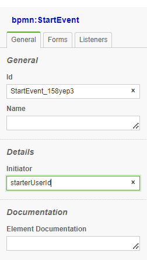

## User Identification and Authentication

BPMNServer does not provide user identification and authentication component, but relies on the calling application to authenticate the user.

Remote calls rely on apiKey to be passed along with the userId

### Web
```javascript

    await server.engine.start(startNodeId,data,{},request.session.userId);  

``` 

### WebAPI/REST

    Since WebAPP is already authenticated by **APIKey** is trusted to pass user object

```javascript

    // get api-key from header
    // url/engine/start

    await server.engine.start(processName,data,startNode,options,userId);  

``` 
## Using BPMNClient as a service

```javascript

    const client= new BPMNClient(url,apiKey);
    // userId is passed here bypassing authentication, assuming user is already authenticated
    
    // await server.engine.start(processName,data,startNode,userId,options);  
    let response = await server.engine.start('Buy Used Car', { caseId: 1050 },null,'user1');

    //await  server.engine.invoke(query, data, userId);

    response = await server.engine.invoke({id: response.id , "items.elementId": 'task_Buy' },{},'user1');

```

# Task Assignee (Camunda Extension)


### Defining Process Initiator
You can define the variable name for the instance initiator 



This will assign the userId of that started the process
```
    console.log(data.starterUserId)
```

## BPMN Editor


At the start of the userTask the designer values are evaluated into the instance item.


## Manual Assignment

An application can prove a UI to allow users to assign tasks to others, this can be done throught the 'assign' method:

```

    const assignment = {assignee: 'user3', candidateUsers: ['user4','user5'],dueDate: new Date()};
    const newData={var1:650};


    response = await server.engine.assign({id: response.id , "items.elementId": 'task_Buy' },newData,userId,assignment);
```

## Searching for Assignment Data

```

    var res = await server.dataStore.findItems(
        {
            "items.status": "wait", "items.elementId": "task_Buy",
            "items.candidateUsers":"user5"
        }
    );
```

The above will return all items Buy Tasks in wait state assigned to 'user5'
